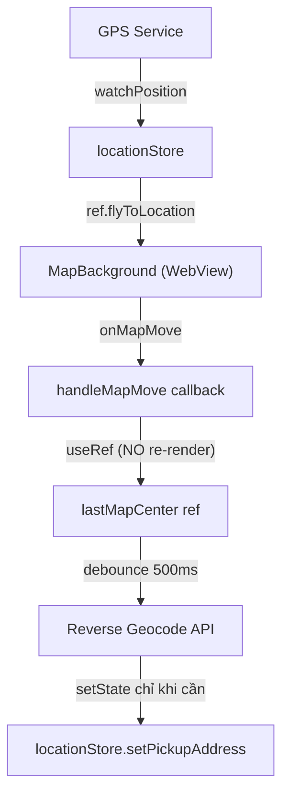

# Kế Hoạch Triển Khai MapBackground — Leaflet/OpenStreetMap via WebView

## Bối cảnh

Thay thế `react-native-maps` (Google Maps, phí API) bằng `MapBackground` — component tự xây dựng dùng `react-native-webview` nhúng bản đồ Leaflet từ OpenStreetMap (miễn phí). Tích hợp vào cả **Customer App** (booking UI) và **Driver App** (thay thế HomeScreen hiện tại).

### Hiện trạng codebase

| App | Maps | Navigation | State | GPS/Permissions |
|-----|------|-----------|-------|----------------|
| **Driver App** | ⚠️ `react-native-maps` (cần thay) | ✅ React Navigation v7 | ✅ Zustand | ✅ `react-native-permissions` |
| **Customer App** | ❌ Chưa có | ❌ Chưa có | ✅ Zustand (rating only) | ❌ Chưa có |

## User Review Required

> [!IMPORTANT]
> **Chi phí vs trải nghiệm:** WebView-based map sẽ chậm hơn native maps (~200-500ms delay trên giao tiếp bridge). Đây là trade-off MVP chấp nhận được, nhưng cần lưu ý khi scale.

> [!WARNING]
> **Driver App breaking change:** [HomeScreen.tsx](file:///d:/ride-hailing-system/driver-app/src/screens/HomeScreen.tsx) hiện tại sẽ được refactor hoàn toàn — xóa `react-native-maps`, `PROVIDER_GOOGLE`, `MapView`, `Marker`, `Polyline` imports. Tất cả map logic chuyển sang `MapBackground` ref API.

> [!CAUTION]
> **Customer App chưa có Navigation:** Cần cài đặt `@react-navigation` trước khi tạo `HomeMapScreen`. Đây là prerequisite.

---

## Proposed Changes

### Component 1: Shared MapBackground Component

#### [NEW] [MapBackground.tsx](file:///d:/ride-hailing-system/driver-app/src/components/MapBackground.tsx)

Copy [MapBackground.txt](file:///d:/ride-hailing-system/MapBackground.txt) thành component TypeScript chính thức. Cải thiện:
- Thêm prop `onMapMove?: (lat: number, lng: number) => void` để parent subscribe
- Thêm prop `initialLat` / `initialLng` để configurable
- Export `MapBackgroundRef` interface

#### [NEW] [MapBackground.tsx](file:///d:/ride-hailing-system/customer-app/src/components/MapBackground.tsx)

Cùng component, copy vào customer-app. (Không dùng shared package vì monorepo không có workspace setup)

---

### Component 2: Dependencies & Permissions

#### Bước 1 — Cài đặt Dependencies

**Driver App** (đã có `react-native-permissions`, `react-native-gesture-handler`):
```bash
cd driver-app
npm install react-native-webview react-native-geolocation-service
npm uninstall react-native-maps   # Xóa Google Maps
```

**Customer App** (cần cài mới hoàn toàn):
```bash
cd customer-app
npm install react-native-webview react-native-geolocation-service react-native-permissions
npm install @react-navigation/native @react-navigation/native-stack @react-navigation/bottom-tabs react-native-screens
```

#### Bước 2 — Cấu hình Quyền (Permissions)

#### [MODIFY] [AndroidManifest.xml](file:///d:/ride-hailing-system/driver-app/android/app/src/main/AndroidManifest.xml)

Thêm permissions (nếu chưa có):
```xml
<uses-permission android:name="android.permission.ACCESS_FINE_LOCATION" />
<uses-permission android:name="android.permission.ACCESS_COARSE_LOCATION" />
<uses-permission android:name="android.permission.INTERNET" />
```

#### [MODIFY] [AndroidManifest.xml](file:///d:/ride-hailing-system/customer-app/android/app/src/main/AndroidManifest.xml)

Cùng permissions cho customer-app.

#### [MODIFY] iOS `Info.plist` (cả 2 app)

```xml
<key>NSLocationWhenInUseUsageDescription</key>
<string>Ứng dụng cần quyền vị trí để hiển thị bạn trên bản đồ và tìm tài xế gần nhất.</string>
<key>NSLocationAlwaysAndWhenInUseUsageDescription</key>
<string>Ứng dụng cần quyền vị trí nền để theo dõi chuyến đi.</string>
```

---

### Component 3: Customer App — HomeMapScreen

#### [NEW] [useLocationPermission.ts](file:///d:/ride-hailing-system/customer-app/src/hooks/useLocationPermission.ts)

Custom hook xin quyền GPS (cross-platform):
```typescript
import { useEffect, useState } from 'react';
import { Platform } from 'react-native';
import { check, request, PERMISSIONS, RESULTS } from 'react-native-permissions';
import Geolocation from 'react-native-geolocation-service';

export function useLocationPermission() {
    const [granted, setGranted] = useState(false);
    const [location, setLocation] = useState<{lat: number; lng: number} | null>(null);

    useEffect(() => {
        const perm = Platform.OS === 'ios'
            ? PERMISSIONS.IOS.LOCATION_WHEN_IN_USE
            : PERMISSIONS.ANDROID.ACCESS_FINE_LOCATION;

        (async () => {
            let status = await check(perm);
            if (status !== RESULTS.GRANTED) {
                status = await request(perm);
            }
            if (status === RESULTS.GRANTED) {
                setGranted(true);
                Geolocation.getCurrentPosition(
                    (pos) => setLocation({ lat: pos.coords.latitude, lng: pos.coords.longitude }),
                    (err) => console.warn('GPS error:', err),
                    { enableHighAccuracy: true, timeout: 15000, maximumAge: 10000 }
                );
            }
        })();
    }, []);

    return { granted, location };
}
```

#### [NEW] [locationStore.ts](file:///d:/ride-hailing-system/customer-app/src/store/locationStore.ts)

Zustand store quản lý tọa độ (tách riêng khỏi tripStore):
```typescript
import { create } from 'zustand';

interface LocationState {
    userLat: number | null;
    userLng: number | null;
    pickupLat: number | null;       // Tọa độ điểm đón (pin trung tâm map)
    pickupLng: number | null;
    pickupAddress: string;
    setUserLocation: (lat: number, lng: number) => void;
    setPickupLocation: (lat: number, lng: number) => void;
    setPickupAddress: (addr: string) => void;
}

export const useLocationStore = create<LocationState>((set) => ({
    userLat: null, userLng: null,
    pickupLat: null, pickupLng: null,
    pickupAddress: '',
    setUserLocation: (lat, lng) => set({ userLat: lat, userLng: lng }),
    setPickupLocation: (lat, lng) => set({ pickupLat: lat, pickupLng: lng }),
    setPickupAddress: (addr) => set({ pickupAddress: addr }),
}));
```

#### [NEW] [HomeMapScreen.tsx](file:///d:/ride-hailing-system/customer-app/src/screens/HomeMapScreen.tsx)

Kiến trúc màn hình chính customer:
```typescript
export default function HomeMapScreen() {
    const mapRef = useRef<MapBackgroundRef>(null);
    const { granted, location } = useLocationPermission();
    const setPickupLocation = useLocationStore(s => s.setPickupLocation);

    // Fly to GPS khi có permission
    useEffect(() => {
        if (location && mapRef.current) {
            mapRef.current.flyToLocation(location.lat, location.lng);
        }
    }, [location]);

    // Giả lập tài xế xung quanh
    useEffect(() => {
        if (location && mapRef.current) {
            const mockDrivers = generateNearbyDrivers(location.lat, location.lng, 5);
            mapRef.current.drawDrivers(mockDrivers);
        }
    }, [location]);

    // Bắt sự kiện onMapMove → cập nhật pickup address
    const handleMapMove = useCallback((lat: number, lng: number) => {
        setPickupLocation(lat, lng);
        // Debounce reverse geocoding ở đây (xem Component 5)
    }, []);

    return (
        <View style={StyleSheet.absoluteFillObject}>
            <MapBackground ref={mapRef} onMapMove={handleMapMove} />
            {/* Pin cố định trung tâm màn hình */}
            <CenterPin />
            {/* Bottom sheet booking form */}
            <BookingBottomSheet />
        </View>
    );
}
```

---

### Component 4: Driver App — Thay thế react-native-maps

#### [MODIFY] [HomeScreen.tsx](file:///d:/ride-hailing-system/driver-app/src/screens/HomeScreen.tsx)

**Xóa hoàn toàn:**
- Import `MapView, { Marker, Polyline, PROVIDER_GOOGLE } from 'react-native-maps'`
- JSX block `<MapView>...</MapView>` (dòng 146-208)
- State `mapRegion` + `useEffect` chỉnh region

**Thay bằng:**
```typescript
import MapBackground, { MapBackgroundRef } from '../components/MapBackground';

// Trong component:
const mapRef = useRef<MapBackgroundRef>(null);

// Khi trip status = ARRIVING → vẽ route đến pickup
useEffect(() => {
    if (tripStatus === TripStatus.ARRIVING && currentTrip && mapRef.current) {
        mapRef.current.updateMarkers(
            21.0252, 105.801,                           // driver location (mock)
            currentTrip.pickup.latitude, currentTrip.pickup.longitude  // pickup
        );
        // Gọi OSRM API miễn phí để lấy route GeoJSON
        fetchRoute(21.0252, 105.801, currentTrip.pickup.latitude, currentTrip.pickup.longitude)
            .then(geoJson => mapRef.current?.drawRoute(geoJson));
    }
}, [tripStatus, currentTrip]);

// JSX:
<MapBackground ref={mapRef} initialLat={21.028511} initialLng={105.804817} />
```

#### [NEW] [fetchRoute.ts](file:///d:/ride-hailing-system/driver-app/src/utils/fetchRoute.ts)

Gọi OSRM (miễn phí) để lấy GeoJSON route:
```typescript
export async function fetchRoute(
    fromLat: number, fromLng: number,
    toLat: number, toLng: number
): Promise<any> {
    const url = `https://router.project-osrm.org/route/v1/driving/${fromLng},${fromLat};${toLng},${toLat}?geometries=geojson&overview=full`;
    const res = await fetch(url);
    const data = await res.json();
    if (data.routes?.[0]) {
        return {
            type: 'Feature',
            geometry: data.routes[0].geometry,
        };
    }
    return null;
}
```

#### [NEW] [useLocationPermission.ts](file:///d:/ride-hailing-system/driver-app/src/hooks/useLocationPermission.ts)

Tương tự customer-app, refactor từ logic permission hiện có trong [HomeScreen.tsx](file:///d:/ride-hailing-system/driver-app/src/screens/HomeScreen.tsx).

---

### Component 5: State Management & Performance (Critical)

#### Kiến trúc quản lý tọa độ



#### Giải pháp chống re-render (Bridge Bottleneck)

**Vấn đề:** `onMapMove` fire liên tục khi kéo map → nếu setState mỗi lần → re-render toàn bộ → WebView re-mount → crash.

**Giải pháp:**

1. **`useRef` thay vì `useState` cho tọa độ map center:**
```typescript
const lastCenter = useRef({ lat: 0, lng: 0 });

const handleMapMove = useCallback((lat: number, lng: number) => {
    lastCenter.current = { lat, lng };  // KHÔNG re-render
    debouncedGeocode(lat, lng);         // Chỉ gọi API sau 500ms idle
}, []);
```

2. **Debounce reverse geocoding (Nominatim miễn phí):**
```typescript
const debouncedGeocode = useMemo(
    () => debounce(async (lat: number, lng: number) => {
        const res = await fetch(
            `https://nominatim.openstreetmap.org/reverse?lat=${lat}&lon=${lng}&format=json`
        );
        const data = await res.json();
        useLocationStore.getState().setPickupAddress(data.display_name || '');
    }, 500),
    []
);
```

3. **`useMemo` trên `MapBackground` component:**
```typescript
// Bọc MapBackground trong useMemo hoặc React.memo
// Props không đổi → không re-render WebView
const MemoizedMap = React.memo(MapBackground);
```

4. **Batch `injectJavaScript` calls:**
```typescript
// TRÁNH: Gọi liên tiếp nhiều lần
mapRef.current?.updateMarkers(...);
mapRef.current?.drawRoute(...);

// NÊN: Gộp thành 1 lần inject duy nhất
const batchJS = `
    ${updateMarkersJS}
    ${drawRouteJS}
    true;
`;
webViewRef.current?.injectJavaScript(batchJS);
```

#### ⚠️ Cảnh báo Bridge Bottleneck

| Scenario | Tần suất | Giải pháp |
|----------|----------|-----------|
| `onMapMove` khi kéo map | ~60fps (16ms) | `useRef` + debounce 500ms |
| `drawDrivers` update vị trí | Mỗi 3-5s | Batch update, không gọi liên tục |
| `drawRoute` GeoJSON lớn | 1 lần/trip | Gọi 1 lần khi trip status thay đổi |
| Nhiều `injectJavaScript` song song | Tùy flow | Gộp thành 1 chuỗi JS duy nhất |

---

## Tổng kết Files mới/sửa

| Action | File | App |
|--------|------|-----|
| **NEW** | `src/components/MapBackground.tsx` | Cả 2 |
| **NEW** | `src/hooks/useLocationPermission.ts` | Cả 2 |
| **NEW** | `src/store/locationStore.ts` | Customer |
| **NEW** | `src/screens/HomeMapScreen.tsx` | Customer |
| **NEW** | `src/utils/fetchRoute.ts` | Driver |
| **MODIFY** | [src/screens/HomeScreen.tsx](file:///d:/ride-hailing-system/driver-app/src/screens/HomeScreen.tsx) | Driver (refactor xóa react-native-maps) |
| **MODIFY** | [package.json](file:///d:/ride-hailing-system/backend/package.json) | Cả 2 (deps) |
| **MODIFY** | `android/app/src/main/AndroidManifest.xml` | Cả 2 (permissions) |
| **MODIFY** | `ios/*/Info.plist` | Cả 2 (permissions) |

---

## Verification Plan

### Automated Tests

Không có unit tests hiện tại cho map/GPS logic. Do WebView-based map không thể unit test trên Jest (cần native runtime), verification dựa vào manual testing.

### Manual Verification

1. **Driver App — Build & Map render:**
   - Chạy `cd driver-app && npx react-native run-android`
   - Xác nhận HomeScreen hiển thị Leaflet map thay vì Google Maps
   - Toggle Online → nhận booking → xác nhận route vẽ trên map

2. **Customer App — Build & GPS:**
   - Chạy `cd customer-app && npx react-native run-android`
   - Xác nhận map hiển thị, GPS permission popup xuất hiện
   - Kéo map → xác nhận địa chỉ pickup cập nhật (debounced)
   - Xác nhận driver icons 🚖 hiển thị xung quanh

3. **Performance check:**
   - Kéo map liên tục 10 giây → xác nhận không crash/lag
   - Mở React Native debugger → xác nhận `onMapMove` không trigger re-render toàn màn hình

> [!IMPORTANT]
> Xin user xác nhận: Bạn muốn tôi tiến hành triển khai từ app nào trước? **Driver App** (refactor HomeScreen hiện có) hay **Customer App** (tạo mới từ đầu)?
